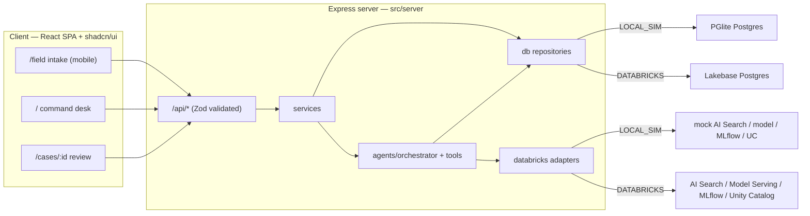

# Architecture

Neelu is a single Node process (Databricks AppKit pattern): an Express server that serves both the `/api` routes and the built React client. In development, Vite runs in middleware mode on the same port; in production (`npm run start`), Express serves `dist/client`.

## Layers

- **`src/shared`** — the single source of truth for types, Zod schemas, and constants. Imported by client, server, agents, and evals so contracts cannot drift.
- **`src/server/db`** — a small `Db` interface with two implementations: `createPglite` (LOCAL_SIM, in-process) and `createPostgres` (Lakebase / any Postgres via `DATABASE_URL`). Both run the *same* `sql/lakebase_schema.sql`. The repository layer maps snake_case rows to camelCase DTOs and is the only place that writes `audit_events`.
- **`src/server/services`** — use-case orchestration: `signals` (intake), `approvals` (approve/override/request-evidence), `demo` (seed/reset), `caseDetail` (assemble the full case view + trace + eval).
- **`src/agents`** — `orchestrator` runs the analysis pipeline using `tools`; `safety` enforces invariants; `fallbackFindings` is the deterministic analyzer; `prompts` holds the constrained model prompt.
- **`src/server/databricks`** — typed adapters per service with LOCAL_SIM mocks and documented DATABRICKS extension points, plus a capability probe.
- **`src/evals`** — deterministic scorers + a CLI harness.
- **`src/client`** — React Router SPA with three routes, a typed `api` client, a small `useApi` hook, and shadcn/ui components.

## Request lifecycle (analyze)

1. `POST /api/signals/:id/analyze` → `orchestrator.analyzeSignal`.
2. Look up the site profile (Unity Catalog adapter) and retrieve guidance (AI Search adapter).
3. Classify the signal — model serving if available, else the deterministic analyzer (marked `fallback: true`).
4. `safety.checkFindingSafety` validates the finding before persistence.
5. Create the case, finding (with citations), evidence, tasks, and DRAFT notices — each via a repository call that also writes an `audit_events` row.
6. Request human approval (status → `awaiting_approval`).
7. Assemble `CaseDetail` including the reconstructed trace and eval scorer results.

Every mutation is auditable; the trace + scorers are recomputed from persisted state, so the Trace tab reflects exactly what happened.
